# APEIRON

A computational pathology framework for whole slide image (WSI) and tile-based analysis. APEIRON provides end-to-end tools for reading, tiling, feature extraction, visualization, annotation, dataset management, and highly-customizable multi-modal downstream inference for histopathology workflows.

*Note: This project will no longer receieve updates unless interests is given via email/phone_number etc*

## 🎨 Gallery & Clinical Showcases

Here are some diagnostic overlays and prediction results generated using APEIRON's downstream models:

### 1. Breast Cancer Metastasis Detection (Ground Truth vs. Predictions)
<p align="center">
  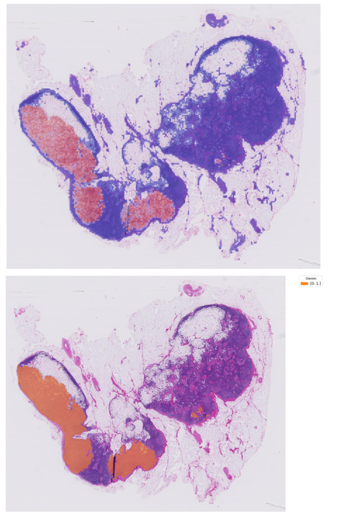
  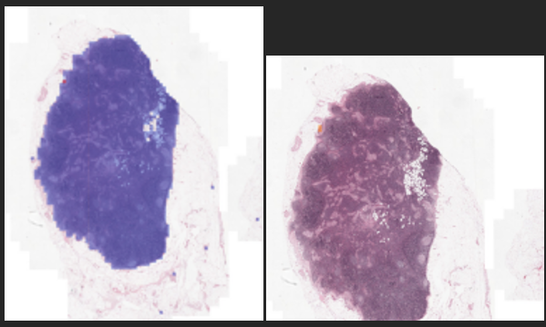
</p>
<p align="center">
  <em>Figure 1: High-resolution breast metastasis macro overlay (left) and zoomed-in micro-metastasis attention regions (right), showcasing predicted positive regions perfectly matching ground truth clinical markings.</em>
</p>

### 2. Multi-Class Gleason Scoring & Prostate Core Classification
<p align="center">
  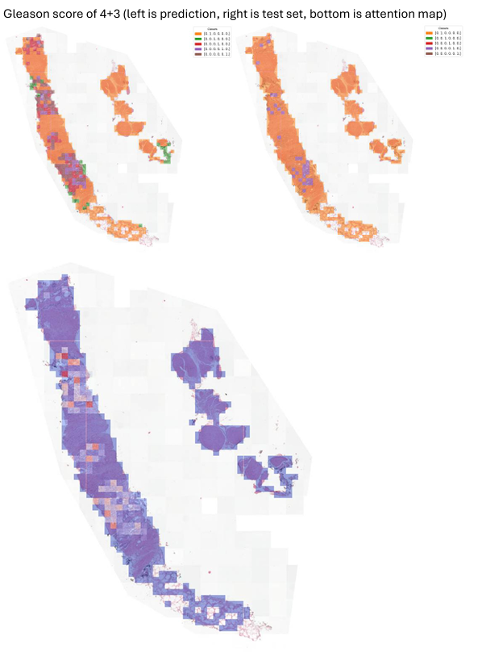
  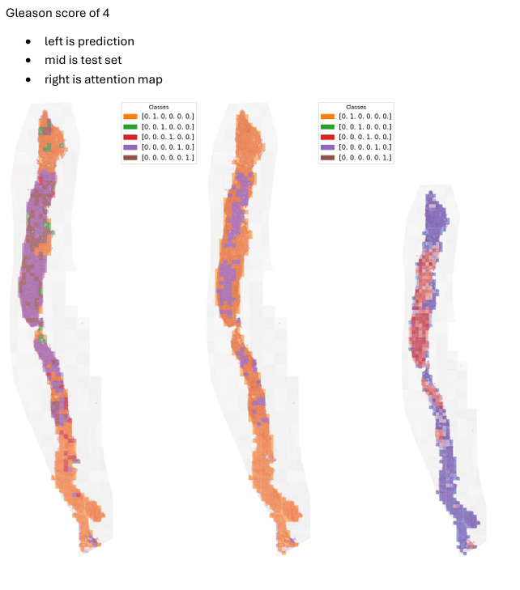
  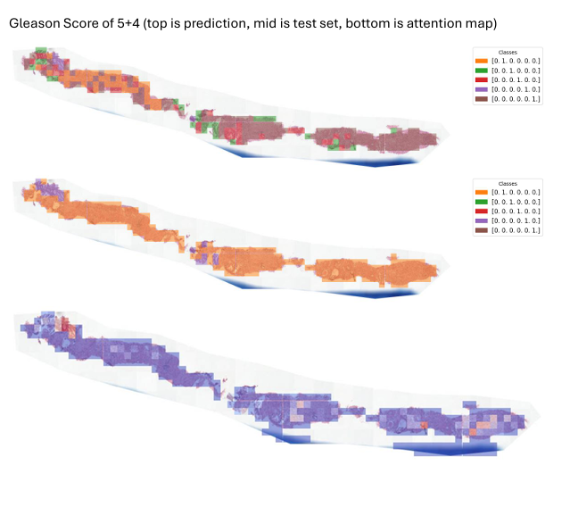
</p>
<p align="center">
  <em>Figure 2: Spatial overlays mapping out predicted high-risk Gleason growth patterns on needle biopsies—Score 4+3 (left), Score 4+4 (middle), and Score 5+4 (right).</em>
</p>

---

## 🏛️ Architecture & Core Principles

APEIRON is organized into two main logical layers:

- **Analyzer** — Low-level worker for single-slide or single-tile analysis. Handles slide reading, stain normalization, tissue segmentation, extraction coordinate mapping, PCA/K-Means visualization, annotation, and single-batch downstream predictions.
- **Operator** — High-level orchestrator that connects the Registry, Manager, Collector, and Searcher for automated batch pipelines, model training, evaluation tracking, and database similarity searches.

Both layers share a single **Backbone** instance that handles the registry, caching, and execution of heavy foundational vision model weights. Downstream modeling leverages **Inferencer** to construct arbitrary multi-head architectures.

### Key Design Principles: Built for Scale & Reusability
APEIRON is engineered to eliminate the high computational overhead of digital pathology workflows:

*   **Zero-Redundancy Artifact Isolation:** Heavy feature extractions, low-resolution tissue masks, downsampled thumbnails, and spatial PCA coordinates are calculated exactly once. These are cached directly inside the central `DATABASE/SLIDE_DATABASE/ARTIFACTS` folder under unique slide UUID mappings.
*   **Fully Decoupled User Projects:** Downstream learning configurations, clinical label mappings, and cohort splitting live entirely inside independent user task folders (e.g., `PROJECTS/task1/`, `PROJECTS/task2/`).
*   **Multi-Project Scaling:** You can reuse pre-calculated embeddings infinitely. To build a completely different study or task (e.g., slide classification vs. survival regression), you simply spin up a new task directory, write a new category-mapping spreadsheet matching your new labels against the existing slide names, and begin training. APEIRON will load the cached HDF5 features instantly with **zero** expensive Vision Transformer (ViT) re-extraction or re-tiling overhead.

### ⚠️ Note on Tile-level Downstream Pipelines
*   **Clinical Standard:** Whole-Slide Image (WSI) models (e.g., Attention-MIL) represent the modern standard of clinical utility, since patch/tile-level annotations are extremely costly, inconsistent, and difficult to obtain in practice.
*   **Pipeline Status:** In line with this, the downstream tile-level training pipeline has been **pseudo-abandoned** in our primary user-facing guides and tutorials to maintain a streamlined, easy-to-understand developer focus.
*   **Under-the-Hood Support:** Note that the entire underlying tile-level architecture (including standalone tile datasets, standalone loaders, tile-coordinate generators, and spatial annotators) remains **fully functional and supported** internally, but is omitted from the main documentation for simplicity.

### Supported Foundational Models
| Key    | Model         | Source       | Feature Dim |
|--------|---------------|--------------|-------------|
| `hop0` | H-optimus-0   | Bioptimus    | 1536        |
| `hop1` | H-optimus-1   | Bioptimus    | 1536        |
| `vir1` | Virchow       | Paige AI     | 1280        |
| `vir2` | Virchow2      | Paige AI     | 1280        |
| `ch15` | CONCH 1.5     | Mahmood Lab  | 512         |
| `uni2h`| UNI2-h        | Mahmood Lab  | 1024        |
| `mstar`| mSTAR         | Wangyh       | 768         |
| `dino3`| DINOv3        | Meta         | 1280        |

---

## 📂 Database & Project Directory Layouts

Before running any code, organize your directories. APEIRON strictly separates raw clinical files (read-only datasets) from pre-calculated artifacts (HDF5 features/images) and project-specific study folders.

### 1. Central Database Root Layout (`/path/to/DATABASE`)
```text
DATABASE/
├── SLIDE_DATABASE/
│   ├── DATASETS/
│   │   ├── prostate/          # Raw whole slide images (.svs, .ndpi, .tiff)
│   │   └── lung/
│   │
│   ├── ARTIFACTS/
│   │   ├── slide_{uuid}/
│   │   │   ├── {slide_name}.json              # Artifact manifest
│   │   │   ├── {slide_name}_extractions.h5    # Pre-extracted features
│   │   │   └── {slide_name}_slide_thumbnail.png
│   │   └── ...
│   │
│   └── registry.csv           # Auto-generated database of UUID mappings
│
└── TILE_DATABASE/
    ├── DATASETS/
    ├── ARTIFACTS/
    └── registry.csv           # Auto-generated standalone tile index
```

### 2. User Project Directory Layout (`/path/to/PROJECTS/user1/task1`)
```text
task1/
├── config.yaml                # Key configuration parameters (template below)
├── raw_clinical_labels.csv    # Your spreadsheet matching slide names to one-hot classes
├── slide_dataset.csv          # Auto-generated merged slide list ready for training
└── annotations/
    ├── shape/                 # QuPath polygon exports (.json)
    └── pixel/                 # Binary tissue masks (.tiff)
```

---

## ⚙️ Configuration Reference (`config.yaml`)

The `config.yaml` file orchestrates everything from data extraction and normalization to model architecture and multi-task learning.

### Master Configuration Template

```yaml
overview_mpp: 8.0

norm_configs: 
  'method': 'macenko'
  'target_name': 'sample2.png'
  
slide_ext:
  ext_configs:
    'ext_enc': 224             # Encoder window size (pixels)
    'ext_mpp': 0.5             # Extraction resolution (MPP)
    'ext_model': hop0          # Foundational model key
    'ext_patch_strategy': 'discard'
  coords_configs:
    'method': 'otsu'
    'ann_mask': False
    'tile_threshold': 0.25
    'stride': 0.0
  feats_configs:
    'window_level': 'tile'     # 'grid', 'tile', 'patch'
    'patch_to_tile': 'discard'
    'grid_size': 2

tile_ext:
  ext_configs:
    'ext_enc': 224
    'ext_mpp': 0.5
    'ext_model': "hop0"
    'ext_patch_strategy': 'keep'
    'ext_type': 'standalone'
  coords_configs:
    'stride': 0.0
  feats_configs:
    'window_level': 'tile'
    'patch_to_tile': 'mean'
    'grid_size': 8

slide_gt:
  'ann_configs':
    'ann_type': 'shape'          # 'shape' (JSON) or 'pixel' (mask)
    'supervision': false         # Bag annotation regions as 'pseudo-slide'
    'background_ratio': 0.2
    'class_id_map':
      '0': 'background'
      '1': 'gleason_3'
      '2': 'gleason_4'
      '3': 'gleason_5'
      '4': 'normal'
      '5': 'stroma'
    'class_id_weights':
      '0': 0.2
      '1': 1
      '2': 1
      '3': 1
      '4': 0.5
      '5': 0.5
  'label_configs':
    'class_id_map':
      '0': 'background'
      '1': 'gleason_3'
      '2': 'gleason_4'
      '3': 'gleason_5'
      '4': 'normal'
      '5': 'stroma'
    'class_id_weights':
      '0': 0.2
      '1': 1
      '2': 1
      '3': 1
      '4': 0.5
      '5': 0.5

tile_gt:
  'label_configs':
    'class_id_map':
      '0': 'background'
      '1': 'gleason_3'
      '2': 'gleason_4'
      '3': 'gleason_5'
      '4': 'normal'
      '5': 'stroma'
    'class_id_weights':
      '0': 0.2
      '1': 1
      '2': 1
      '3': 1
      '4': 0.5
      '5': 0.5

slide_downstream:
  'model_configs':
    'inf_models': ['roimil']
    'lbl_loss_type': 'soft_ce'
    'ann_loss_type': 'soft_ce'
  'train_configs':
    'lr': 0.0001
    'optimizer': 'adam'
    'weight_decay': 0.0
    'scheduler': null
  'split_configs':
    'train_ratio': 0.8
    'auto_split': true

tile_downstream:
  'model_configs':
    'inf_models':  ['classifier', 'generative', 'contrastive']
    'lbl_loss_type': 'soft_ce'
  'train_configs':
    'lr': 0.0001
    'optimizer': 'adam'
    'weight_decay': 0.0
    'scheduler': null
  'split_configs':
    'train_ratio': 0.8
    'auto_split': true
```

### Parameter API Reference

#### Global Configurations
*   `overview_mpp` *(float)*: MPP resolution used to compute WSI overview thumbnails and tissue segmentations.
*   `norm_configs`:
    *   `method` *(str)*: Stain normalization algorithm. Options: `'macenko'`, `'vahadane'`.
    *   `target_name` *(str)*: Name of target template image placed under `normalise_targets/` to align slide color profile against.

#### Feature Extraction (`slide_ext`, `tile_ext`)
*   `ext_configs`:
    *   `ext_enc` *(int)*: Pixel window size passed to the Vision Transformer (e.g. `224`).
    *   `ext_mpp` *(float)*: Microscopic resolution (MPP) target for embedding extraction.
    *   `ext_model` *(str)*: Registered backbone model (e.g. `'hop0'`).
    *   `ext_patch_strategy` *(str)*: Patch tokens handling strategy. `'discard'` (keep CLS only; low memory), `'aggr'` (pooling), `'keep'` (keep all patch tokens).
*   `coords_configs`:
    *   `method` *(str)*: Tissue detection method. Options: `'otsu'`, `'morphological'`.
    *   `ann_mask` *(bool)*: If `true`, restricts tile coordinate extraction exclusively to annotated regions.
    *   `tile_threshold` *(float)*: Minimum tissue percentage required to keep a tile (0.0 to 1.0).
    *   `stride` *(float)*: Overlap fraction between adjacent tiles (e.g., 0.0 for no overlap, 0.5 for 50% overlap).
*   `feats_configs`:
    *   `window_level` *(str)*: Spatial level of features. Options: `'grid'`, `'tile'`, `'patch'`.
    *   `patch_to_tile` *(str)*: Aggregation method when converting patch tokens to tile level. Options: `'discard'`, `'mean'`, `'max'`.
    *   `grid_size` *(int)*: Spatially group adjacent features into uniform blocks (e.g. `2`, `8`).

#### Ground Truth Targets (`slide_gt`, `tile_gt`)
*   `ann_configs`:
    *   `ann_type` *(str)*: Format of input annotations. Options: `'shape'` (GeoJSON vectors), `'pixel'` (TIFF masks). Refer to the [Annotation Formats Guide](apeiron/entity/README.md#expected-raw-annotation-formats) for exact schemas.
    *   `supervision` *(bool)*: Treat annotating boundaries as standalone 'pseudo-slides' for highly localized MIL supervision.
    *   `background_ratio` *(float)*: Ratio of negative background tiles to sample during training.
*   `label_configs` & `ann_configs` *(Class Mappings)*:
    *   `class_id_map` *(dict)*: Maps numerical model output indices (as string keys, e.g. `'0'`) to diagnostic text names.
    *   `class_id_weights` *(dict)*: Floating-point loss multipliers per class to mitigate cohort imbalances.

#### Downstream Execution (`slide_downstream`, `tile_downstream`)
*   `model_configs`:
    *   `inf_models` *(list[str])*: Target multi-task prediction heads. Options: `'abmil'`, `'gatmil'`, `'roimil'`, `'unet'`, `'spconv'`, `'detr'`, `'mask2f'`, `'classifier'`, `'generative'`, `'contrastive'`.
    *   `lbl_loss_type` / `ann_loss_type` *(str)*: Model objective functions.
        *   **Classification:** `'hard_ce'` (exclusive integers), `'focal'` (minority class weighting), `'soft_ce'` (probability distributions).
        *   **Multi-Label:** `'bce'` (binary cross entropy), `'multilabel_focal'`.
        *   **Regression:** `'mse'` (mean squared error), `'mae'` (mean absolute error).
        *   **Ranking:** `'margin'` (pairwise margin loss), `'listnet'` (list-wise KL ranking).
        *   **Segmentation:** `'dice'` (intersection over union, ideal for `unet`/`mask2f`).
        *   **Distribution Matching:** `'kldiv'` (KL divergence).
*   `train_configs`:
    *   `lr` *(float)*: Model learning rate.
    *   `optimizer` *(str)*: Options: `'adam'`, `'adamw'`, `'sgd'`.
    *   `weight_decay` *(float)*: L2 weight penalties.
    *   `scheduler` *(str or null)*: Learning rate scheduler. Options: `'cosine'`, `'step'`, `null`.
*   `split_configs`:
    *   `train_ratio` *(float)*: Train split partition fraction (e.g. `0.8`).
    *   `auto_split` *(bool)*: Automatically generate class-stratified train/validation splits.

---

## 🚀 Step-by-Step Beginner's Tutorial

This comprehensive tutorial guides you linearly from manipulating single raw slides up to batch cohort extraction, training, validation, and similarity searches.

---

### Phase 1: Low-Level Single Slide Analysis (`Analyzer`)

The `Analyzer` operates directly on a single slide. It is ideal for interactive debugging, coordinate mapping, and run-time exploration inside a Jupyter Notebook.

#### 1. Setup & Backbone Initialization
```python
import apeiron as ap

models_save_dir = "/path/to/MODELS/foundational_models"
slide_path = "/path/to/DATABASE/SLIDE_DATABASE/DATASETS/prostate/slide_001.svs"

# Load the Backbone registry which caches heavy foundation ViT model weights
backbone = ap.Backbone(models_save_dir)

# Initialize Analyzer at 0.5 MPP extraction and 224x224 encoder window sizes
analyzer = ap.Analyzer(backbone, ext_enc=224, ext_mpp=0.5)
analyzer.assign_model(model_name='hop0')  # Load the Bioptimus H-optimus-0 model
analyzer.open_slide(slide_path=slide_path)
```

#### 2. Low-Resolution Thumbnails & Stain Normalization
```python
# Generate standard downscaled whole-slide overview (e.g., 8.0 MPP / ~16x downsample)
thumbnail = analyzer.get_slide_thumbnail(target_mpp=8.0)

# Extract binary Otsu/morphological tissue masks to ignore empty glass background
tissue_mask = analyzer.get_masked_thumbnail(target_mpp=8.0)

# Normalize stains to a clinical target profile using Macenko/Vahadane algorithms
normalised = analyzer.normalise_image(
    analyzer.slide_thumbnail,
    norm_configs={"target_img_path": "targets/sample_breast.png", "method": "macenko"}
)
```

#### 3. Spatial Grid Generation & Feature Extraction
```python
# Generate tile extraction grids. Stride controls tile overlaps (0.0 = none)
analyzer.create_tile_coords(method='morphological', tile_threshold=0.25, stride=0.0)

# Stream tiles into PyTorch datasets and run parallel ViT feature extraction
# ext_patch_strategy controls whether to keep ('keep') or aggregate ('aggr'/'discard') patch tokens
analyzer.prepare_tiles_dataset(mode='slide')
analyzer.extract_tiles(batch_size=300, num_workers=4, ext_patch_strategy='discard')
```

#### 4. Feature Post-Processing & Dimensionality Visualization
Once slide embeddings are extracted, you can group, aggregate, and visualize high-dimensional features (e.g., 1536-dim vectors from `hop0`) using spatial pooling, unsupervised PCA, K-Means clustering, or query-based similarity scoring:

##### A. Configure Feature Representation Level
Call `analyzer.prepare_features` to specify how individual ViT patch tokens are spatially pooled or structured:
*   `window_level`: Specifies the spatial representation level.
    *   `'tile'`: Default window size of the backbone.
    *   `'grid'`: Merges tiles spatially into larger uniform blocks (configured via `grid_size`).
    *   `'patch'`: Retains raw individual ViT patch tokens for precise, micro-level tissue segmentation.
*   `patch_to_tile`: Defines token aggregation strategy. Options: `'mean'`, `'max'`, `'discard'`.
*   `grid_size`: Dimension of the feature grid merge (e.g., `2`, `8`).

##### B. Visualization & Heatmap Overlay Modes
APEIRON supports three distinct dimensional reduction and overlay visualizations:
*   **PCA Feature Color Map (`mode='color'`)**: Uses Principal Component Analysis (PCA) to compress high-dimensional feature spaces directly into 3D RGB color channels, allowing you to visually recognize structural shifts in tissue morphology.
*   **Unsupervised K-Means Clusters (`mode='clusters'`)**: Groups embedding vectors into distinct feature categories (e.g., automatically segmenting tumor epithelium vs. benign stroma).
*   **Cosine Similarity Scores (`mode='score'`)**: Calculates and maps similarity values of every spatial tile relative to selected target query indices (ideal for targeted cell or structure searches).

```python
# 1. Post-process raw slide embeddings into spatial grid blocks
analyzer.prepare_features(window_level='tile', patch_to_tile='mean', grid_size=2)

# 2. Compute and render PCA Feature Color overlay
analyzer.compute_feats_color(method='pca')
viz_color = analyzer.create_feature_viz(mode='color')
viz_color.show(alpha=0.5)

# 3. Compute and render K-Means spatial cluster overlay
analyzer.compute_feats_color(n_clusters=10)
viz_clusters = analyzer.create_feature_viz(mode='clusters')
viz_clusters.show(alpha=0.5)

# 4. Compute and render Tile Cosine Similarity Score overlay
# Target query indices can be manually chosen to match reference structures
analyzer.compute_feats_color(query_indices=[0, 2, 4])
viz_score = analyzer.create_feature_viz(mode='score')
viz_score.show(alpha=0.5)
```

<p align="center">
  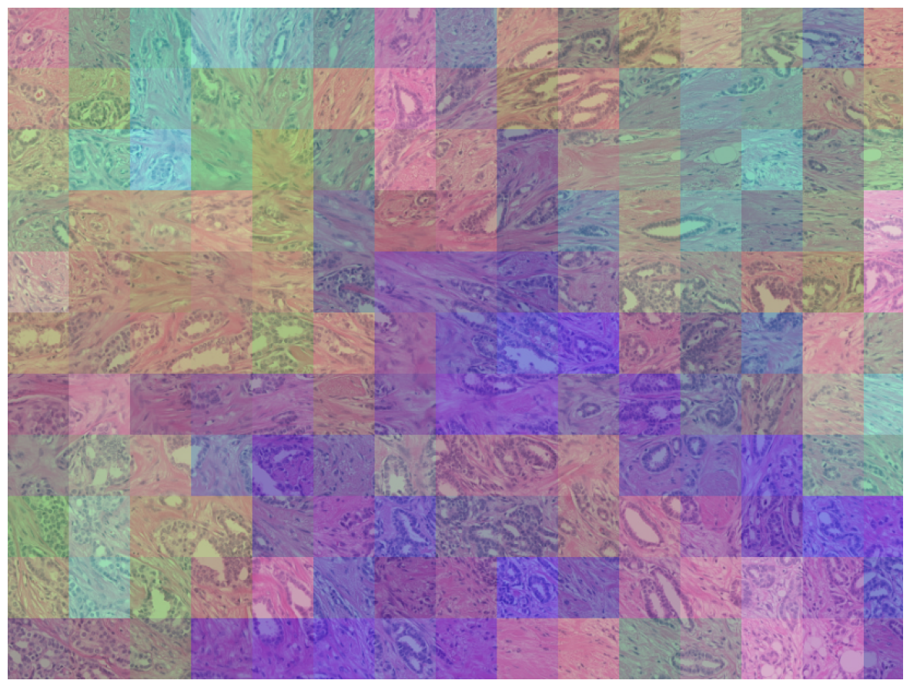
  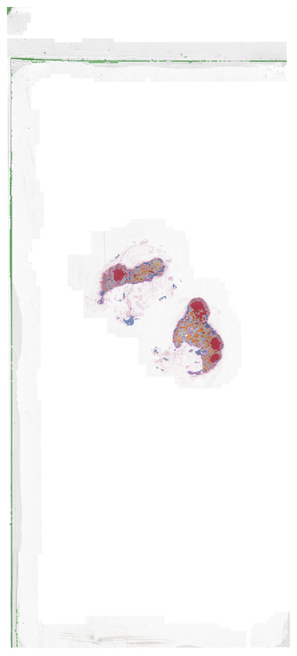
  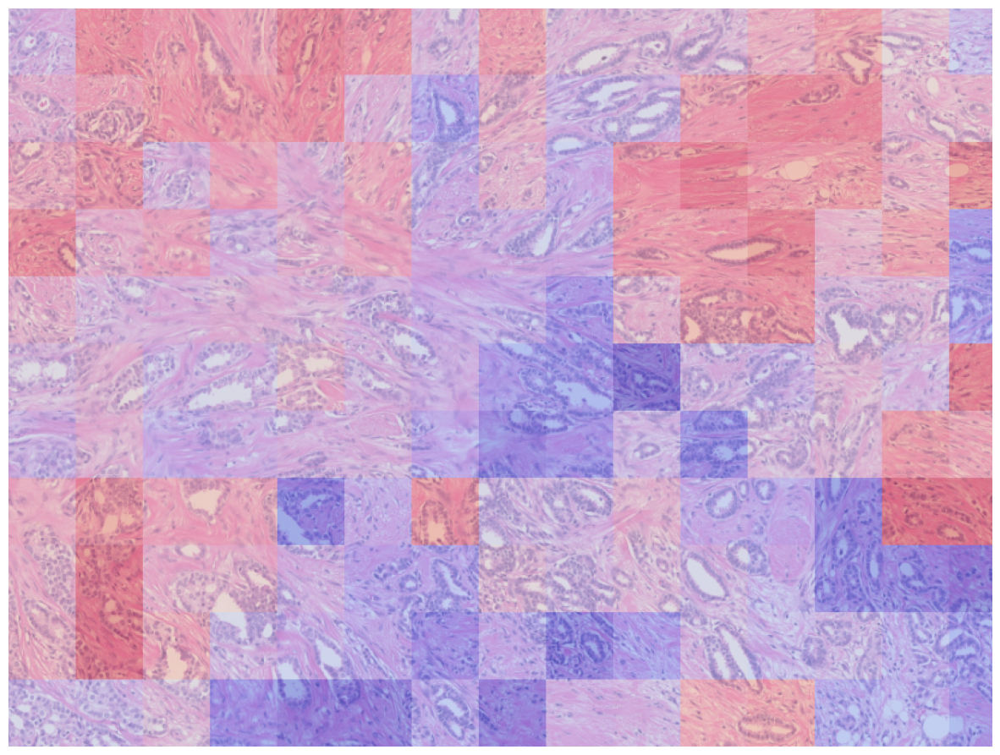
</p>
<p align="center">
  <em>Figure 3: Slide feature visualization overlays. Left: project high-dimensional embeddings into 3D RGB space via PCA. Middle: Unsupervised K-Means clustering isolating stroma, epithelium, and glands. Right: Cosine similarity mapping relative to selected target query structures.</em>
</p>

#### 5. Manual Ground-Truth Annotation Overlay
If you have manual annotations (such as GeoJSON boundary shapes exported from QuPath, TIFF pixel masks, or direct dictionary annotations), you can align them with your spatial extraction grids for training or validation:

```python
# Load manual/ground-truth annotations (e.g., QuPath GeoJSON shapes or pixel masks)
analyzer.prepare_annotations(ann_path="/path/to/annotations.json", ann_type="shape")

# Visualize the loaded ground-truth spatial annotations overlay
viz_ann = analyzer.create_annotation_viz(mode='annotation')
viz_ann.show(alpha=0.5)
```

<p align="center">
  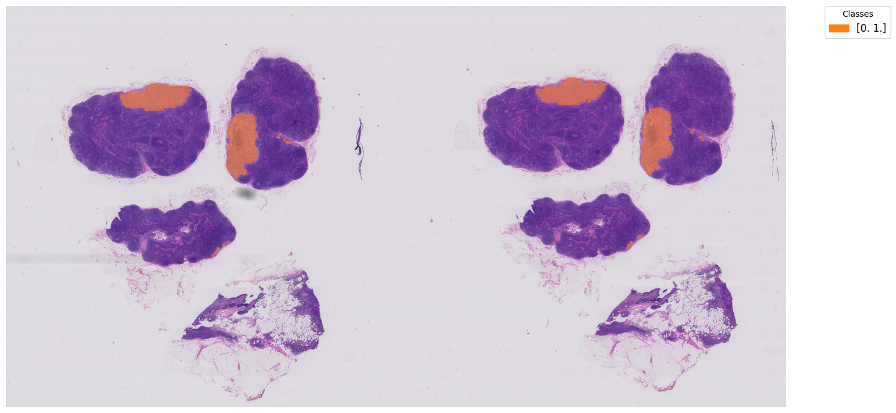
</p>
<p align="center">
  <em>Figure 4: Ground-truth manual spatial annotations aligned with extraction grids.</em>
</p>

---

### Phase 2: High-Level Dataset Cohort Automation (`Operator`)

When dealing with hundreds of Whole Slide Images, manual slide-by-slide manipulation is tedious. The `Operator` wraps all underlying systems (Registry, ArtifactIO, and Collector) to orchestrate batch actions in multi-processed streams.

#### 1. Setup the Operator Workspace
```python
import apeiron as ap

root_dir = "/path/to/DATABASE"
project_path = "/path/to/PROJECTS/user1/task1"
models_save_dir = "/path/to/MODELS/foundational_models"
downstream_model_path = "/path/to/MODELS/downstream_models"

# Backbone automatically appends 'foundational_models/' internally
backbone = ap.Backbone(models_save_dir)

# Initialize Operator with global database, backbone, and stored model pathing
operator = ap.Operator(
    backbone=backbone, 
    root_dir=root_dir, 
    downstream_model_path=downstream_model_path
)
operator.setup(project_path)
```

#### 2. Automatic Data Ingestion & Dataset Merging
```python
# 1. Scans folders under DATABASE/SLIDE_DATABASE/DATASETS/ for unregistered WSIs
# Assigns absolute UUIDs and maps paths safely to registry.csv
operator.ingest_data(data_classes=['prostate', 'lung'], mode='slide')

# 2. Match external spreadsheets against registry UUIDs to lock active project slides
# Merges slide names, matches duplicate paths, and creates 'slide_dataset.csv'
operator.create_datasets(labels_path='raw_clinical_labels.csv', label_col=['class0', 'class1', 'class2'], mode='slide')
```

> 🧠 **Ingesting and Mapping at Scale (Database Decoupling):**
> 
> *   **1. What does `ingest_data` do?**
>     This indexes the raw tissue files you placed under `DATABASE/SLIDE_DATABASE/DATASETS/` in Phase 1. It scans your folders with code, registers files with persistent, absolute UUIDs, and records their paths inside the central database index `SLIDE_DATABASE/registry.csv`.
> 
> *   **2. Database Reusability across projects (Enterprise Scale):**
>     The slide names listed inside your project's `raw_clinical_labels.csv` **do not** have to correspond only to the files you *just* ingested in this session. When you call `operator.create_datasets()`, APEIRON attempts to map your names against the **entire historical registry** of slides ever ingested into your database. This means you can include slides processed months ago or across other active user projects.
> 
> *   **3. Custom Slicing & Manual Cohort Subsets:**
>     Because the active training list is completely decoupled from database ingestion, you can easily build your own custom cohort subsets. You can manually copy slide names or retrieve absolute `slide_id` UUIDs straight from `SLIDE_DATABASE/registry.csv`, assign your own classes, and write your own `slide_dataset.csv`. This architectural separation allows the framework to scale seamlessly to external database backends (e.g., PostgreSQL, Snowflake) in production.
> 
> *   **4. Spreadsheet Column Mapping:**
>     Downstream training expects slide-level labels to be formatted as numerical columns: `class0`, `class1`, `class2` (matching the integer keys inside your `config.yaml` `class_id_map`).
> 
>     You define these columns in your `raw_clinical_labels.csv` spreadsheet:
>     | slide_name | class0 | class1 | class2 |
>     |---|---|---|---|
>     | slide_001 | 1.0 | 0.0 | 0.0 |
>     | slide_002 | 0.0 | 1.0 | 0.0 |
> 
>     Calling `operator.create_datasets(labels_path='raw_clinical_labels.csv', label_col=['class0', 'class1', 'class2'], mode='slide')` will:
>     1. Scan the central database registry for matching filenames.
>     2. Map absolute, unique UUIDs (`slide_id`) to each slide.
>     3. Left-join your one-hot class columns against those matched UUIDs.
>     4. Save the finalized training-ready list as `slide_dataset.csv`.

#### 3. Batch Artifact Extraction
```python
# Switch Operator to write mode to generate and cache artifacts to disk
operator.set_io_mode('w')

# Generate tissue mask overviews for all slides asynchronously
operator.generate_thumbnails(modes=["slide_thumbnail", "masked_thumbnail"])

# Multi-process GPU extraction of H-optimus embeddings saved directly to h5 databases
operator.generate_embeddings_slide(batch_size=300, num_workers=4)

# Batch dimensionality reduction for global visualizers
operator.generate_feats_color()
```

#### 4. Instant Slide Serving & Active Exploration
Once your cohort artifacts are generated and cached, you can "serve" any slide instantly by its UUID. 

Calling `operator.serve_slide_analyzer(slide_id, data_modes='all')` dynamically streams all pre-calculated slide records (tissue masks, coordinates, HDF5 embeddings, PCA colors) from the database and returns a **fully functional `Analyzer` instance**:

```python
# 1. Grab absolute slide UUID from the database index using its name
slide_id = operator.lookup_table('slide_001', mode='slide')[0]

# 2. Serve the slide. This returns a fully-fledged, active low-level Analyzer!
# Specifying data_modes='all' automatically loads all pre-calculated assets
analyzer = operator.serve_slide_analyzer(slide_id, data_modes='all')

# 3. All Analyzer methods are now instantly available with zero computation overhead!
# No raw SVS file openings, no tiling, and no Vision Transformer (ViT) feature extractions are required.
viz_clusters = analyzer.create_feature_viz(mode='clusters')
viz_clusters.show(alpha=0.5)

# You can run stain normalizations, annotation overlays, clustering, or predictions:
analyzer.prepare_annotations(ann_path="annotations/shape/slide_001.json", ann_type="shape")
viz_ann = analyzer.create_annotation_viz(mode='annotation')
viz_ann.show()
```

> 💡 **The Power of the Served Analyzer**
> By serving a slide, you bridge the gap between low-level interactive research and high-level database scales. The returned `analyzer` object is identical in class structure and capability to a manual slide-opened `Analyzer`, meaning **any method, visualization, or custom post-processing routine demonstrated in Phase 1 can be executed instantly** on served slides!

---

### Phase 3: Multi-Task Downstream Training

APEIRON lets you train complex downstream architectures directly from your cached embeddings. Rather than coding PyTorch scripts, you define your heads (`inf_models`), loss functions, and learning rates in the `slide_downstream` section of your `config.yaml`.

#### 1. Cohort Splitting Options
> 📊 **Cohort Splitting: Auto Stratification vs. Manual Splits**
> When split routines run, APEIRON divides your active cohort into distinct training and validation slides. You have two options:
>
> *   **Option A: Trust Auto Stratification (`auto_split: true`)**
>     APEIRON automatically computes a stratified train/validation split preserving overall label proportions across both cohorts (utilizing `train_ratio` to balance the sizes).
>
> *   **Option B: Specify Manual Splits (`auto_split: false`)**
>     If you want strict, deterministic cross-validation splits, set `auto_split: false` inside your `config.yaml`. APEIRON will skip auto-generation and instead scan for binary `train` and `valid` columns directly inside your `raw_clinical_labels.csv` or `slide_dataset.csv`:
> 
>     | slide_name | class0 | class1 | class2 | train | valid |
>     |---|---|---|---|---|---|
>     | slide_001 | 1.0 | 0.0 | 0.0 | **1** | **0** |
>     | slide_002 | 0.0 | 1.0 | 0.0 | **1** | **0** |
>     | slide_003 | 0.0 | 0.0 | 1.0 | **0** | **1** |
> 
>     *(Note: Assign `1` to include the slide in the training or validation split, and `0` to exclude it.)*

#### 2. Downstream Execution (Training & Model Storage)
First compile your model, train it over your cohort, and export it for downstream production tasks:

```python
# 1. Initialize models, parameters, and optimizers compiled from your config.yaml
operator.intitalise_inferencer(mode='slide', load_epoch='best')

# 2. Train the multi-task model over 15 epochs with a batch size of 4 slides
# Operator automatically handles data iteration, gradient accumulation, and loss reporting
train_history = operator.train(n_epochs=15, batch_size=4)

# 3. Permanently save the trained network as a standalone, plug-and-play inference model
# This generates a version-controlled model file (e.g. 'task1_production_1') inside your central model path
operator.store_inferencer(name='production')

# 4. Generate validation metrics curves, training history plots, and evaluation reports
operator.val_graphs()
operator.plot_history()
```

<p align="center">
  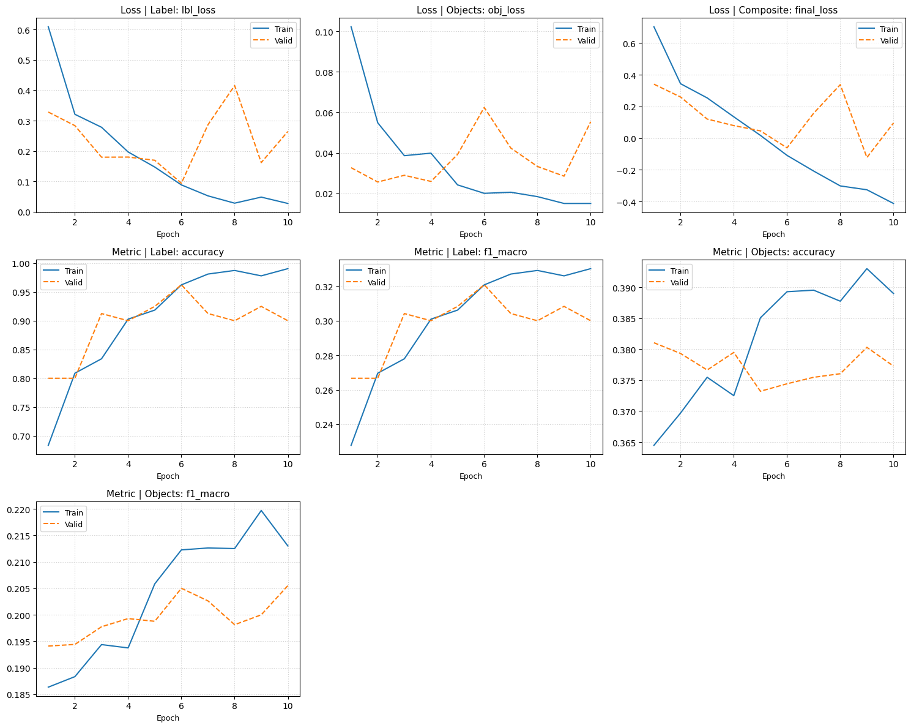
</p>
<p align="center">
  <em>Figure 5: Multi-task continuous loss and metric tracking history over training epochs.</em>
</p>

<p align="center">
  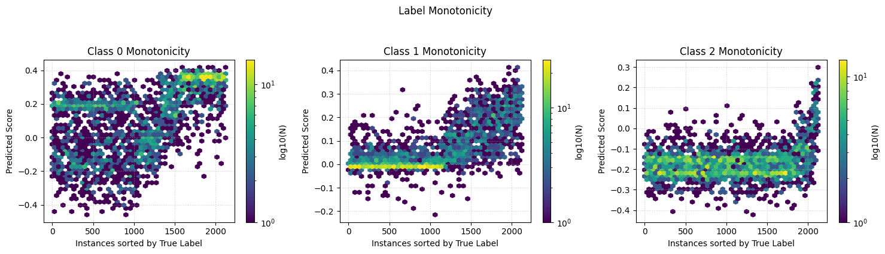
  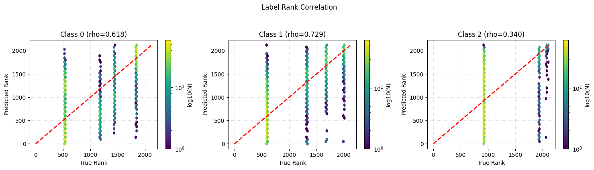
</p>
<p align="center">
  <em>Figure 6: Detailed multi-task validation curves—ROC/PR and calibration curves for slide label heads (left) and spatial annotation Dice segmentation tracking (right).</em>
</p>

##### Clinical Metrics & Evaluation Performance Reports
To assess clinical performance, APEIRON automatically generates high-density multi-modality confusion matrices, receiver operating characteristic (ROC) curves, and calibration summaries for your target pathology tasks:

<p align="center">
  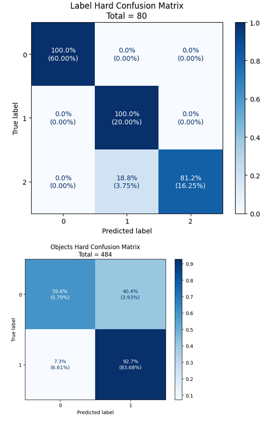
  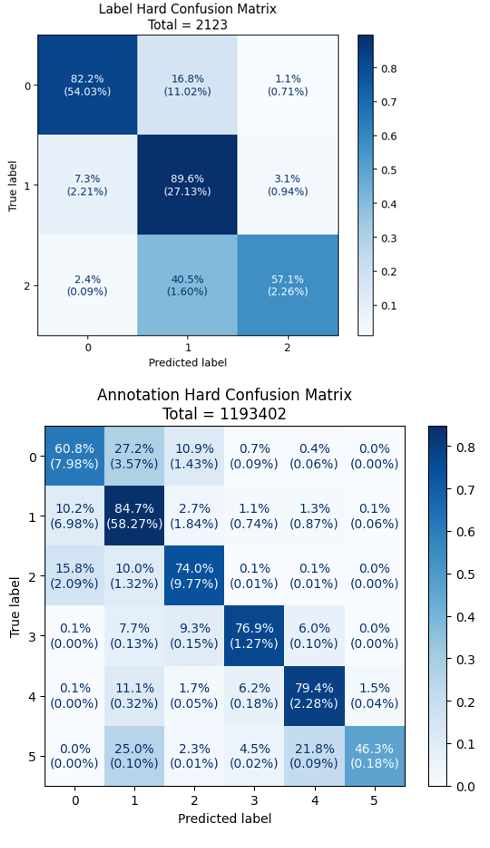
</p>
<p align="center">
  <em>Figure 7: In-depth clinical diagnostic evaluation. Left: ROC and confusion matrices for binary Breast Cancer Metastasis classification. Right: Micro-level performance evaluation for Multi-Class Gleason Scoring showing calibration and class-specific PR curves.</em>
</p>

---

### Phase 4: Standalone Production Inference (Serving)

Once exported, you can deploy your standalone model inside any active session. APEIRON strictly separates basic inference from advanced ROI supervised prediction for optimal workflow clarity.

#### Part A: Basic Inference (Raw Prediction)
For standard slide classification or regression (where no manually segmented tissue regions are supplied), simply query the database and trigger serving:

```python
# 1. Load the stored standalone model directly onto your active workspace
operator.intitalise_inferencer(mode='slide', direct_name='task1_production_1')

# 2. Retrieve target slide UUID using its database slide name
slide_id = operator.lookup_table(['slide_001'], mode='slide')[0]

# 3. Serve the slide. Specifying 'pred' in data_modes automatically runs forward pass inference
# and stores outputs inside the served slide's `analyzer.mdata` container
analyzer = operator.serve_slide_analyzer(
    slide_id, 
    data_modes='pred', 
    ann_path=None, 
    ground_truth=True
)

# 4. Retrieve standardized, formatted predictions
results = analyzer.mdata.get_label_results()
print(f"Predicted Class Index: {results['label']}")
print(f"Category Probabilities: {results['score']}")
if results['text']:
    print(f"Generated VLM Context: {results['text']}")

# 5. Render overlays (e.g. model attention weights)
viz = analyzer.create_annotation_viz(mode='pred_atn')
viz.show()
```

#### Part B: Advanced ROI Inference (Spatially-Supervised Heads)
For advanced models requiring localized region-of-interest supervision (like `ROIMIL` or `SparseDETR`), pass custom dictionaries mapping local tile indices to diagnostic classes directly through the `ann_path` argument:

```python
# 1. Load the stored standalone model
operator.intitalise_inferencer(mode='slide', direct_name='task1_production_1')
slide_id = operator.lookup_table(['slide_001'], mode='slide')[0]

# 2. Structured ROI Annotations:
# Package custom annotations and region bounding boxes mapping tile indices to target classes
ann_path = {
    'annotations': None,  # (N, C) tile-level mask array (if any)
    'objects': [
        {'label': [0, 0, 1], 'ids': np.array([1000, 1001, 1002, 1003, 1004])}
    ]
}

# 3. Serve slide with supervised bounding structures
analyzer = operator.serve_slide_analyzer(
    slide_id, 
    data_modes='pred', 
    ann_path=ann_path, 
    ground_truth=True
)

# 4. Render localized object detection overlays
viz = analyzer.create_annotation_viz(mode='pred_obj')
viz.show()
```

> 🎨 **Visualization Overlay Modes (`create_annotation_viz`):**
> When calling `create_annotation_viz(mode=...)`, you can customize the rendering mode by passing any of the following supported options:
> *   `'annotation'`: Displays the raw, ground-truth manual annotations overlay.
> *   `'pred_lbl'`: Renders a class color overlay representing the slide-level label prediction.
> *   `'pred_ann'`: Displays the model's localized tile-level prediction maps.
> *   `'pred_atn'`: Renders a heatmapped overlay of the visual attention weights (e.g., highlighting where the MIL model focused).
> *   `'pred_obj'`: Draws target bounding boxes and segmented region borders for spatially detected regions/ROI classes.

---

> 🧠 **Slide Prediction via Serving (`serve_slide_analyzer`):**
> Notice that you do not call a standalone prediction function in a vacuum. Instead, you **serve** the slide by its unique `slide_id` using `operator.serve_slide_analyzer(..., data_modes='pred')`. This:
> 1. Dynamically streams the slide's pre-computed embedding features and spatial coordinates from HDF5.
> 2. Automatically triggers high-speed forward pass inference on those features and populates the returned slide `analyzer.mdata` container with the prediction outputs.
>
> 🎯 **Direct Supervised ROI Input (`ann_path`):**
> For advanced spatially-supervised heads such as `ROIMIL` or `detr` that require localized Region of Interest (ROI) boundaries or bag-level supervision, you can feed direct NumPy coordinate dictionary structures into the `ann_path` parameter:
> *   `'annotations'`: Direct `(N, C)` class matrix or tissue-level label masks.
> *   `'objects'`: A list of region dictionaries, e.g. `[{'label': [0,0,1], 'ids': np.array([1000, 1001, ...])}]` where `ids` maps the exact spatial tile indices belonging to that specific micro-structure.

APEIRON automatically routes data correctly, handles homoscedastic multi-loss weight balance via `AutomaticWeightedLoss`, and populates a unified `ModelData` dataclass.

---

### Phase 5: High-Throughput Similarity Search (FAISS + VLAD)

To scale searching across millions of clinical patches, APEIRON utilizes a **Vector of Locally Aggregated Descriptors (VLAD)** projection. It clusters raw embeddings on the fly, aggregates spatial features into single, highly compact, fixed-length global slide representations, and indexes them using GPU-accelerated **FAISS** flat indices.

#### 1. Build and Index the Database
Before querying, you must fit the K-Means centers over your dataset stream and aggregate the descriptors to populate the FAISS search index:

```python
# 1. Initialize descriptor stream generator across all active project slides
vlad_generator = operator.get_descriptor_generator(mode='slide')

# 2. Fit K-Means cluster centroids on a GPU-friendly chunk of your dataset
# (Sets visual anchor centers to group local patch features)
operator.fit_from_generator(vlad_generator, max_samples=250000)

# 3. Aggregate individual slide tiles into fixed-size global slide embeddings
# Projects (N, F) embeddings -> compact (K * F) VLAD descriptors and indexes them in FAISS
operator.build_index(vlad_generator)
```

#### 2. Executing Queries (Global WSI & Local ROI Search)
Standard queries utilize pure visual descriptors. They work **out-of-the-box immediately** using standard foundation backbones (like H-optimus-0 or Virchow) without needing any linguistic text embeddings:

```python
slide_id = operator.lookup_table('slide_001', mode='slide')[0]

# Run standard visual queries:
# - 'feat': Finds slides globally matching the query slide's aggregate VLAD feature vector.
# - 'roi': Matches regional tile clusters to find similar tissue micro-structures.
results = operator.similarity_search(
    mode='slide',
    query_mode=['feat', 'roi'], 
    query_feat_id=[slide_id],
    query_roi_id=[10, 11, 12, 13],  # Target tile indices representing your Query ROI
    top_k=5,
    similarity_threshold=0.85
)

# Output matching results tables
print(results.feat_res)  # Global slide similarity DataFrame (id, distance)
print(results.roi_res)   # Local regional similarity DataFrame (id, distance)
```

#### 3. Cross-Modal Text-to-Image Queries (Linguistic Search)
If a contrastive or generative vision-language model is active, you can query your visual database using free-text natural language prompts:

```python
# Run cross-modal search:
# - 'wrd': Align natural-language text prompts against WSI image database features
results = operator.similarity_search(
    mode='slide',
    query_mode=['wrd'], 
    query_text="high-grade prostate adenocarcinoma with gland fusion",
    top_k=5
)

# Output matching results matrix
print(results.wrd_res)   # Cross-modal text-image similarity matrix (id, score)
```

> ⚠️ **Note on Cross-Modal Search (`wrd` / `img` modes):**
> Cross-modal text-to-image queries requiring linguistic embeddings (`wrd_emb` and `img_emb` matching) are fully supported and implemented internally in the searcher pipeline. However, they require contrastive or generative vision-language model heads (such as CONCH or native CLIP-style decoders) which are currently **pending a stable release and delayed indefinitely** in user-facing configurations.

> 🚀 **Scale Your Search Library Instantly**
> Because the search index building is completely decoupled from active physical folder limits, you can scale your indexed search database into thousands of slides. Simply pull *any* slide names/embeddings across your central database into your project's `slide_dataset.csv` spreadsheet.
> 
> Internally, the VLAD compression and FAISS flat-index operations are **highly optimized and GPU-accelerated**. Building indices or executing queries across millions of patches takes only milliseconds, so scaling up your database has virtually zero performance impact on index building or matching latency!\n